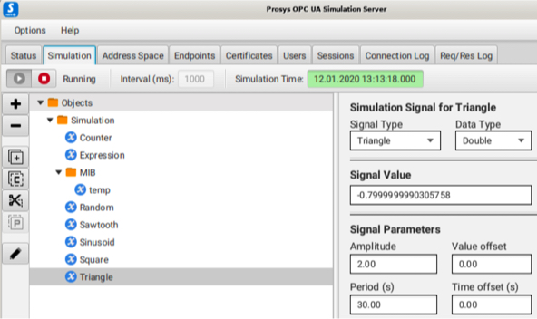
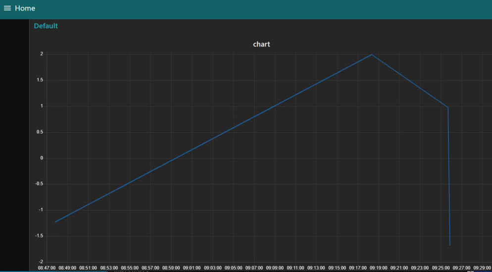
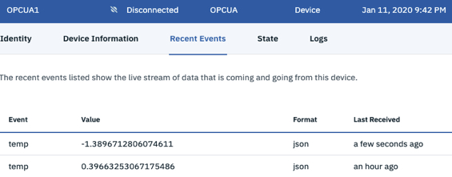

# Transfer OPC-UA Data to the IBM Internet of Things platform
While modern information technology/IT systems use protocols like http, websockets, MQTT  (for IoT) and architectural styles (e.g. REST),   for operations technology/OT systems in manufacturing and plants a variety of other protocols are being used. In order to use this data a protocol conversion is needed. Fortunately [OPC-UA](https://en.wikipedia.org/wiki/OPC_Unified_Architecture) becomes a standard protocol and OPC-UA servers can be used to collect data from southbound automation systems (like SCADA, PLC) that later can be consumed on the shopfloor/OT (e.g. predictive maintenance) or in combined OT/IT (worker assistants) e.g. uses cases. 
  

These are the steps to consume (simulated) OPC UA data on the IoT platform. Note, that the data is pulled from the OPC-UA server. Meanwhile the OPC-UA protocol supports publish/subscribe, see the [announcement](https://opcfoundation.org/news/press-releases/opc-foundation-announces-opc-ua-pubsub-release-important-extension-opc-ua-communication-platform/) of the OPC foundation.

## OPC UA Server 
* create an [Ubuntu 16.04 VM](https://cloud.ibm.com/classic/devices) on the IBM Cloud (register to the IBM Cloud, if not done already) with a public IP address (your-opc-ua-server-address)
* note down the root password of the Ubuntu VM
* install a web browser from the command line
* setup [security groups](https://cloud.ibm.com/classic/security/securitygroups) for the ports that are needed for that device: allow_opc_ua/inbound&outbound/53530, allow_ssh/inbound/22, allow_vnc/inbound/5900-5999 and assign them to the VM

We are using the **Prosys OPC-UA Simulation server** to create some OPC-UA simulation data
* download and install the [Prosys OPC-UA Simulation Server](https://www.prosysopc.com/products/opc-ua-simulation-server/) via the Ubuntu desktop
* run the Prosys OPC UA Simulation Server from the Ubuntu desktop and note down the ocp.tcp address, e.g. opc.tcp://your-opc-ua-address:53530/OPCUA/SimulationServer
* active Options > Expert Mode
* on the Simulation tab modify the simulation data that is needed

* on the Address Space tab you can see the attribute values of all simulated variables; we are using the temp varibale:  *ns=3;s=temp* 
* Optional (for testing purposes): install an OPC UA client on your local machine and connect to the OPC UA server using the ocp.tcp address

## IoT Platform
* create an [Internet of Things Platform service](https://cloud.ibm.com/catalog/services/internet-of-things-platform) and note down your Internet of Things Organization ID, e.g. lt9l36
* create an Internet of Things *device*, which represents the interface to the Node-RED application; note down Device Type (e.g. OPCUA), Device ID (e.g. OPCUA1) and the Authentication Token
* create an IoT app (under https://youriotorgid.internetofthings.ibmcloud.com/dashboard/apps/browse) note down the API Key and the API Token, use *Standard App* as role

## Node-RED application
Node-REDs used to receive any incoming OPC-UA messages from the OPC simulation server and send them to the IoT platform
* install Node-RED locally, as a Docker container or as part of the [Node-RED starter kit] (https://cloud.ibm.com/catalog/starters/node-red-starter) on the IBM Cloud
* install the *node-red-contrib-opcua*, *node-red-dashboard* and *node-red-contrib-scx-ibmiotapp* nodes via the Hamburger icon > Manage palette
* import the [Node-RED flow](./node-red-flow) 
* configure the OPC-UA client node *OPC-UA*: Endpoint = opc.tcp://your-opc-ua-server-address:53530/OPCUA/SimulationServer
* configure the IBM IoT node: Device Type, Device ID, API Key, API Token, servername (youriotorgid.internetofthings.ibmcloud.com) 

## Test
* go to https://youriotorgid.internetofthings.ibmcloud.com/dashboard/devices/browse
* click on your device (OPCUA1) and *Recent Events*
* in Node-RED app click on the inject node
* the opc ua client node is pulling the current data from the OPC-UA server, data OPC-UA data is displayed on the dashboard and ...

* ... transfered to the IoT platform, there should be an event showing up under Recent Events

